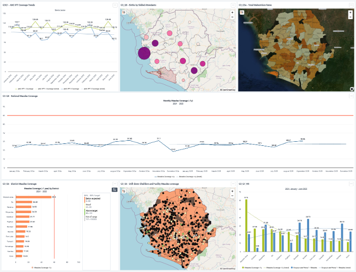
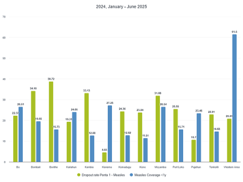

# Maternal and Child Health Indicators in Sierra Leone - Healthcare Analytics

## Overview

Maternal and child health analytics across 13 districts and 149 chiefdoms in Sierra Leone using DHIS2 data. Applied time series forecasting, geospatial analysis, deep learning, statistical correlation, and hierarchical analysis to analyze ANC coverage, immunization, and malnutrition.
**Tools:** R, keras3, ggplot2, forecast, dplyr, tidyr, DHIS2, Jupyter Notebooks, Sentinel-2 satellite imagery.

## Objectives

1. **Time Series Forecasting**: Apply linear regression, SES, and ARIMA models to forecast ANC IPT coverage trends and retention rates
2. **Geospatial Analysis**: Map births by skilled attendants and malnutrition rates by chiefdom using GIS to identify geographic service gaps
3. **Measles Vaccination Analysis**: Hierarchical drill-down (district → chiefdom → facility), Pearson correlation of dropout rates, and temporal/geographic/data quality trend classification
4. **Deep Learning**: Apply ResNet50 transfer learning to choropleth maps for malnutrition prediction with CNN-based spatial pattern recognition
5. **Data Quality Assessment**: Identify validation rules and reporting gaps in DHIS2 data completeness
6. **Dashboard Development**: Create integrated DHIS2 dashboard consolidating maternal and child health indicators

## Dashboard

---

## 1. Maternal Health Domain

#### **ANC IPT Coverage Trendline Analysis**

**Objective:** Analyze ANC IPT 1 and IPT 2 coverage trends to identify when trendlines will intersect.

**Methodology:** Linear regression using least squares method with 6-month trendline forecast

**Key Findings:** Diverging IPT 1 and IPT 2 trendlines indicate worsening retention rates between doses

---

#### **SES Forecast for Western Area**

**Objective:** Forecast ANC IPT 2 coverage for December 2025 using Simple Exponential Smoothing.

**Methodology:**
- Simple Exponential Smoothing (SES) with α optimization
- Tools: R (`forecast`, `HoltWinters()`)

**Key Findings:** α = 0.3 model achieved better accuracy (MAE = 9.97, forecast = 95.75%) with smoother forecasting approach

---

#### **Births by Skilled Attendants**

**Objective:** Identify districts with lowest births by skilled attendants and analyze geographic barriers.

**Methodology:** Geospatial mapping with GIS and OpenStreetMap layers

**Key Findings:** Bonthe district has lowest births by skilled attendants, driven by remoteness and geographic barriers

## 2. Immunization Domain

#### **National Measles Coverage Analysis**

**Objective:** Analyze national measles coverage trends and identify months missing 60% target.

**Methodology:** Time series analysis with 60% coverage threshold visualization

**Key Findings:** Coverage consistently below 60% target (range: 18-32%), indicating persistent national underperformance

---

#### **Drill-Down Analysis of Low Coverage**

**Objective:** Identify specific districts, chiefdoms, and facilities that missed 60% measles coverage target.

**Methodology:**
- Hierarchical drill-down analysis (District → Chiefdom → Facility)
- Tools: R (`dplyr`, `tidyr`), DHIS2 Maps

**Key Findings:** 129 chiefdoms and 85 facilities missed 60% target; data quality issues identified in remote regions

---

#### **Trend Type Analysis**

**Objective:** Describe the type of trend of low measles vaccination coverage.

**Methodology:** Multi-dimensional trend classification (temporal, geographic, data quality)

**Key Findings:** Three trend types identified: time-based (chronically low), geographic (remote clustering), data quality (under-reporting)

---

#### **Dropout Rate Correlation**

**Objective:** Analyze correlation between Penta1-Measles dropout rate and measles coverage.

**Methodology:** Pearson correlation analysis (Dropout rate vs. Measles Coverage)

**Key Findings:** Weak negative correlation (Pearson: -0.295) indicates broader system-level issues beyond dropout rates

---

## 3. Child Malnutrition Domain

#### **Geospatial Malnutrition Analysis**

**Objective:** Map malnutrition rates by chiefdom and identify areas with highest and lowest rates.

**Methodology:**
- Geospatial choropleth mapping with GIS
- Tools: DHIS2 Maps, Sentinel-2 satellite imagery

**Key Findings:** Lowest in Malema (2.4%), highest near Freetown: Kaffu Bullom (33.21%), Lokomasama (34.77%)

---

#### **Deep Learning: ResNet50 for Malnutrition Prediction**

**Objective:** Predict severe malnutrition for Bo district using spatial patterns from neighboring districts.

**Methodology:**
- ResNet50 transfer learning with CNN for spatial pattern recognition
- Tools: R (`keras3`, `imager`)

**Key Findings:** Achieved 67% accuracy (F1: 0.667), demonstrating geographic interdependence in malnutrition rates

---

## Critical Insights Identified

1. **Diverging ANC Retention Patterns:** IPT 1 and IPT 2 trendlines moving apart rather than converging, indicating worsening dropout rates between first and second visits

2. **Systematic Measles Underperformance:** National coverage chronically below 60% target across ALL months (18-32%), suggesting structural barriers beyond seasonal variation

3. **Geographic Clustering of Service Gaps:** Remote districts (Bonthe, Koinadugu, Kono, Pujehun) consistently show lowest performance across multiple indicators, driven by infrastructure and accessibility challenges

4. **Urban Malnutrition Paradox:** Peri-urban areas near Freetown (Kaffu Bullom 33%, Lokomasama 35%) show unexpectedly high malnutrition rates, contradicting typical urban health advantages

5. **Data Quality vs. Service Delivery Duality:** High vaccine stock issuance with zero recorded doses administered indicates both true service gaps AND significant reporting/data completeness issues

6. **Weak Dropout-Coverage Correlation:** Pearson correlation of -0.295 between Penta1-Measles dropout and coverage reveals that retention alone cannot explain low immunization performance

7. **Spatial Autocorrelation in Malnutrition:** Deep learning model successfully predicted district-level malnutrition using spatial patterns from neighboring regions (67% accuracy), demonstrating geographic interdependence

8. **Model Performance Insights:** SES forecasting showed smoother models (α=0.3, MAE=9.97) outperformed responsive models (α=0.7, MAE=10.33), suggesting value in reducing noise over tracking volatility

---

## Authors

- Lalitha Pranathi Pulavarthy
- Erica Babb
- Haritha Reddy Karingula
- Ross Prater
- Ying Liu

**Instructor:** Dr. Saptarshi Purkayastha
